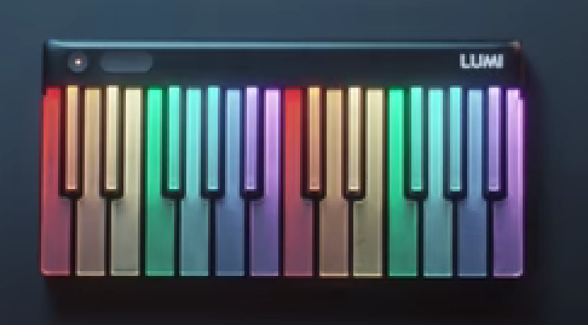

# [[Link]](https://shivamk034.github.io/piano/) Piano Web Application with Tone.js

## Description
The Piano Web Application is a user-friendly online tool that replicates the experience of playing a piano digitally. Users can interact with the virtual piano interface by clicking on keys or using their computer keyboard. The application is built using HTML, CSS, and JavaScript, with the added functionality of Tone.js to generate and control audio.

## Key Features:
- Realistic Piano Interface: The user interface closely resembles a traditional piano layout, making it intuitive for users familiar with piano keyboards.
- Multi-Octave Support: Users can change the octave range to access a broader range of notes, enabling them to play various melodies and chords.
- Polyphonic Playback: The application supports playing multiple notes simultaneously, allowing users to experiment with harmonies and create complex musical compositions.
- Responsive Design: The web application is designed to be responsive, ensuring optimal user experience across different devices and screen sizes.
- Easy-to-Use Controls: The user interface includes intuitive controls for octave selection and playback, making it accessible to users of all skill levels.
- Audio Visualization: Visual feedback, such as key highlighting or waveform visualization, enhances the user experience and provides feedback on played notes.

### Inspired by LUMI by Roli

